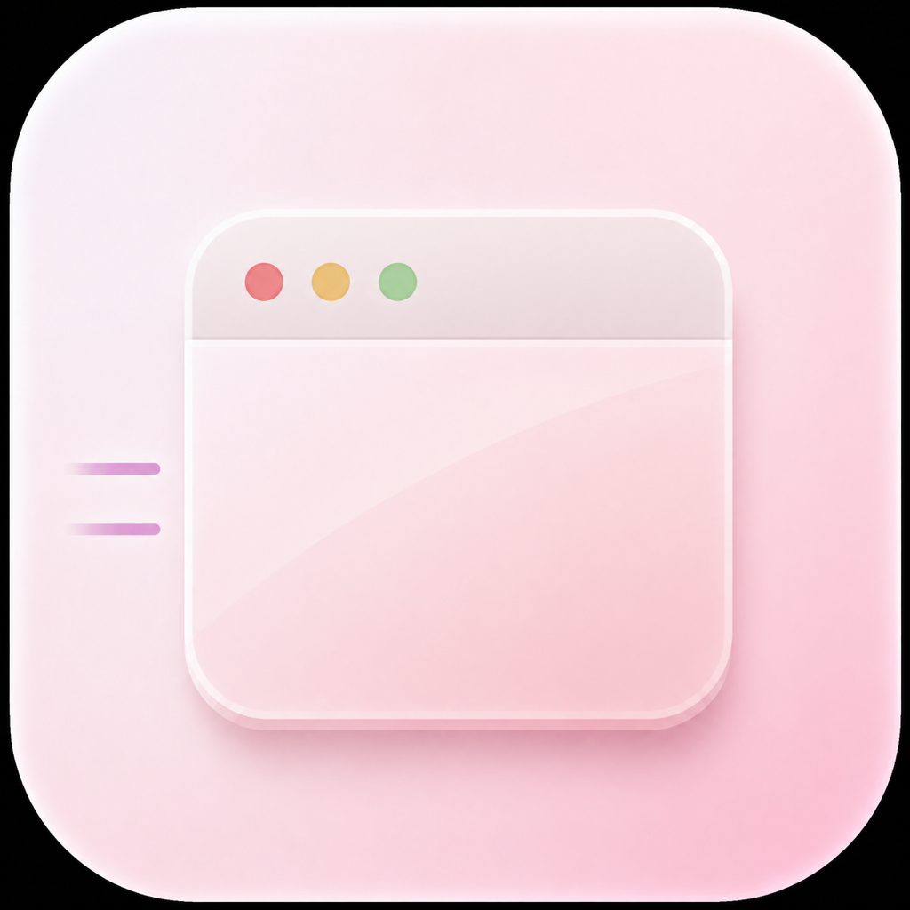

  

<h1 align="center">Scoot</h1>

  <strong>Keep video windows visible, not in the way.</strong>

  Scoot keeps FaceTime and Picture-in-Picture windows out of your way while you work—so you can use your full screen without constantly dragging them around.

## Make space for what you are working on

Scoot is a small macOS menu bar utility for the moments when you need a call or video in view, but do not want it covering the thing you are trying to do. Arm a window and Scoot moves it aside as your cursor approaches, keeping your workspace clear without losing the video.

## Built for

- FaceTime calls
- Picture-in-Picture video
- Tutorials, demos, and streams
- Any normal movable macOS window you want to keep within reach

## How it works

1. Focus the window you want to keep out of the way.
2. Arm it from Scoot’s menu-bar icon or global shortcut.
3. Move your cursor toward it—Scoot shifts the window aside.
4. Toggle Scoot off when you are done.

Scoot includes a configurable shortcut, an option to keep the window above the Dock, and an optional start-at-login setting.

## Downloads

[Download Scoot v0.1.0 for macOS](https://github.com/lambegraham/scoot/releases/download/v0.1.0/Scoot-0.1.0.zip)

The download is signed and notarized by Apple. See [all releases](../../releases) for release notes and checksums.

## Requirements

- macOS 14 or later
- Accessibility permission, so Scoot can read and move the window you arm

## Privacy

Scoot only monitors mouse movement while a window is armed. It does not record, store, or send your input.

## Source availability

This repository is the home for Scoot releases and release notes. The application source code is not published at this time.
